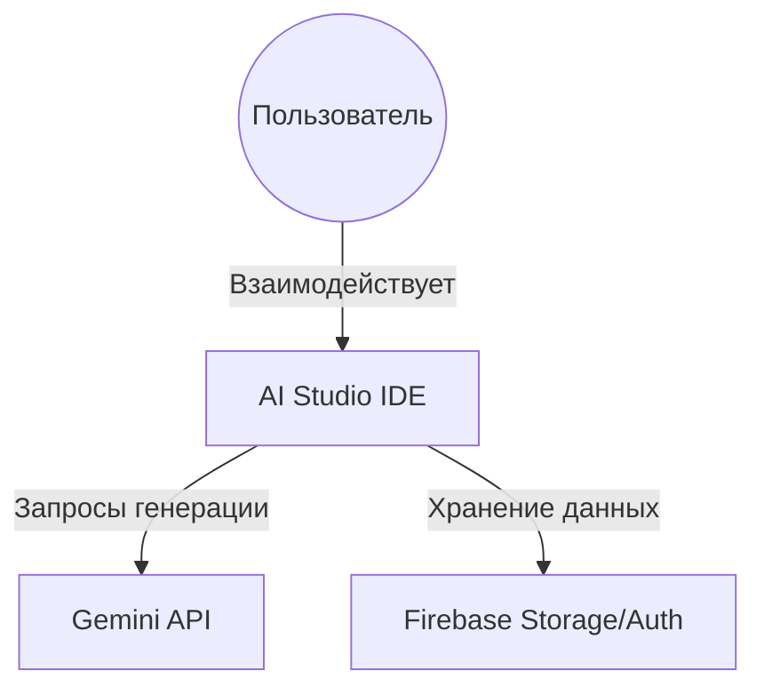

# 🌍 Уровень 1: Системный контекст (System Context)

## 📝 Детальное описание
Приложение представляет собой интеллектуальную IDE нового поколения, ориентированную на визуальное программирование и генерацию артефактов в реальном времени. Система объединяет классический интерфейс разработки с мощными возможностями LLM (Gemini), позволяя пользователю не только писать код, но и мгновенно визуализировать сложные структуры данных, диаграммы и прототипы.

Ключевой особенностью является концепция "Артефактов" — изолированных сущностей (код, схемы, превью), которые живут в контексте диалога и могут быть мгновенно изменены ИИ по запросу пользователя.

## 📊 Схема системы (C4 Context)

## 🛠️ Модульная структура
- contains-container:: [[2-Containers/Frontend/Frontend-Container|Контейнер: Frontend]]
- contains-container:: [[2-Containers/Backend/Backend-Container|Контейнер: Backend]]

## 👤 Пользовательские истории (User Stories)
- relates-to:: [[1-Context/System-Context#Разработчик|Story: Architect]]
- relates-to:: [[1-Context/System-Context#Технический писатель|Story: Documenter]]

## 📄 Функции управления контекстом
| Функция | Параметры | Описание |
| :--- | :--- | :--- |
| `initializeSystem` | `config: AppConfig` | Инициализирует базовые сервисы и проверяет доступность API. |
| `syncAppState` | `state: GlobalState` | Синхронизирует состояние между локальным хранилищем и облаком. |

## Навигация
- navigates-to:: [[Index|Вернуться к оглавлению]]
