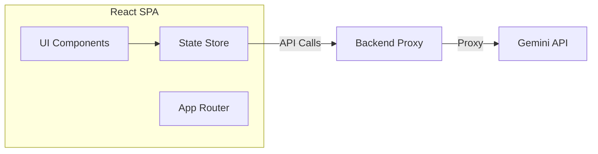

# 📦 Контейнер: Frontend (React SPA)

## 📝 Детальное описание
Frontend-контейнер является "сердцем" пользовательского интерфейса. Он реализует сложную логику управления состоянием (State Management) для чата и артефактов, обеспечивает бесшовную интеграцию с Gemini API через прокси-слой и управляет жизненным циклом всех визуальных компонентов. 

Особое внимание уделено производительности при рендеринге тяжелых SVG-диаграмм и интерактивности при работе с масштабируемыми контейнерами.

## 📊 Схема контейнера (C4 Container)

## Навигация
- is-part-of:: [[1-Context/System-Context|Системный контекст]]
- relates-to:: [[2-Containers/Backend/Backend-Container|Контейнер: Backend]]
- navigates-to:: [[Index|Вернуться к оглавлению]]

## 📄 Основные методы контейнера
| Функция | Параметры | Описание |
| :--- | :--- | :--- |
| `useAppStore` | `selector: (state) => any` | Хук для доступа к глобальному состоянию приложения. |
| `dispatchAction` | `action: ActionType` | Централизованный метод для изменения состояния системы. |

## Downstream (Компоненты)
- contains-component:: [[3-Components/Frontend/IDELayout/IDELayout-Component|IDELayout]]
- contains-component:: [[3-Components/Frontend/Sidebar/Sidebar-Component|Sidebar]]
- contains-component:: [[3-Components/Frontend/ArtifactPanel/ArtifactPanel-Component|ArtifactPanel]]
- contains-component:: [[3-Components/Frontend/ChatPanel/ChatPanel-Component|ChatPanel]]
- contains-component:: [[3-Components/Frontend/FileExplorer/FileExplorer-Component|FileExplorer]]
- contains-component:: [[3-Components/Frontend/ProjectPanel/ProjectPanel-Component|ProjectPanel]]
- contains-component:: [[3-Components/Frontend/MermaidPreview/MermaidPreview-Component|MermaidPreview]]
- contains-component:: [[3-Components/Frontend/BananaRenderer/BananaRenderer-Component|BananaRenderer]]
- contains-component:: [[3-Components/Frontend/ExcalidrawDiagram/ExcalidrawDiagram-Component|ExcalidrawDiagram]]
- contains-component:: [[3-Components/Frontend/HtmlPreview/HtmlPreview-Component|HtmlPreview]]
- contains-component:: [[3-Components/Frontend/ZoomableContainer/ZoomableContainer-Component|ZoomableContainer]]
- contains-component:: [[3-Components/Frontend/ContextLog/ContextLog-Component|ContextLog]]
- contains-component:: [[3-Components/Frontend/SkillsPanel/SkillsPanel-Component|SkillsPanel]]
- contains-component:: [[3-Components/Frontend/TTSControls/TTSControls-Component|TTSControls]]
