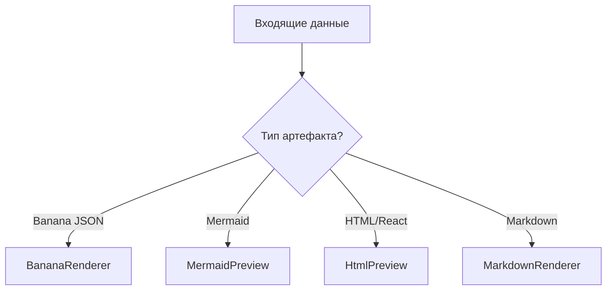

# 🧩 Компонент: ArtifactPanel

## 📝 Детальное описание
ArtifactPanel — это многофункциональный контейнер для визуализации результатов работы ИИ. Он автоматически определяет тип контента (код, схема, HTML) и выбирает соответствующий рендерер. Панель поддерживает переключение между режимом предпросмотра и исходным кодом, а также отображает системные логи процесса генерации.

## 📊 Логика выбора рендерера (Decision Tree)

## 📄 Методы компонента
| Функция | Параметры | Описание |
| :--- | :--- | :--- |
| `setActiveArtifact` | `id: string` | Устанавливает текущий отображаемый артефакт. |
| `toggleViewMode` | `mode: 'preview' \| 'code'` | Переключает режим отображения (визуализация или код). |
| `exportArtifact` | `format: 'svg' \| 'png'` | Экспортирует текущую визуализацию в файл. |

## Навигация
- parent-component:: [[3-Components/Frontend/IDELayout/IDELayout-Component|IDELayout]]
- relates-to:: [[3-Components/Frontend/ChatPanel/ChatPanel-Component|ChatPanel]]
- navigates-to:: [[Index|Вернуться к оглавлению]]

## Рендереры
- sub-component:: [[3-Components/Frontend/ZoomableContainer/ZoomableContainer-Component|ZoomableContainer]]
- sub-component:: [[3-Components/Frontend/BananaRenderer/BananaRenderer-Component|BananaRenderer]]
- sub-component:: [[3-Components/Frontend/MermaidPreview/MermaidPreview-Component|MermaidPreview]]
- sub-component:: [[3-Components/Frontend/ExcalidrawDiagram/ExcalidrawDiagram-Component|ExcalidrawDiagram]]
- sub-component:: [[3-Components/Frontend/HtmlPreview/HtmlPreview-Component|HtmlPreview]]
- sub-component:: [[3-Components/Frontend/ContextLog/ContextLog-Component|ContextLog]]
