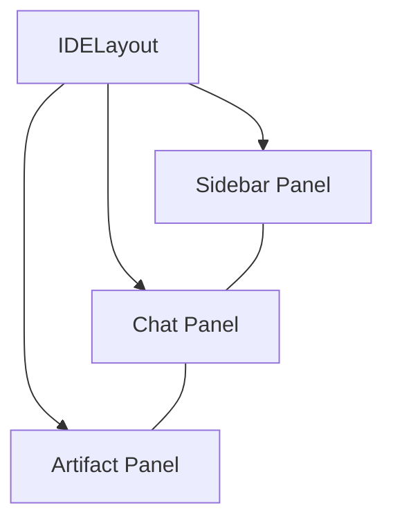

# 🧩 Компонент: IDELayout

## 📝 Детальное описание
Корневой компонент макета, реализующий трехпанельную структуру (Sidebar, Chat, Artifacts). Он управляет адаптивностью интерфейса, позволяя скрывать или изменять размер панелей в зависимости от контекста работы пользователя. Компонент обеспечивает визуальную целостность всей IDE.

## 📊 Структура макета (Layout Diagram)

## 📄 Методы компонента
| Функция | Параметры | Описание |
| :--- | :--- | :--- |
| `toggleSidebar` | `visible: boolean` | Переключает видимость боковой панели. |
| `resizePanels` | `sizes: number[]` | Устанавливает пропорции ширины для каждой из трех панелей. |

## Навигация
- is-part-of:: [[2-Containers/Frontend/Frontend-Container|Контейнер: Frontend]]
- navigates-to:: [[Index|Вернуться к оглавлению]]

## Структура
- sub-component:: [[3-Components/Frontend/Sidebar/Sidebar-Component|Sidebar]]
- sub-component:: [[3-Components/Frontend/ArtifactPanel/ArtifactPanel-Component|ArtifactPanel]]
- sub-component:: [[3-Components/Frontend/ChatPanel/ChatPanel-Component|ChatPanel]]
