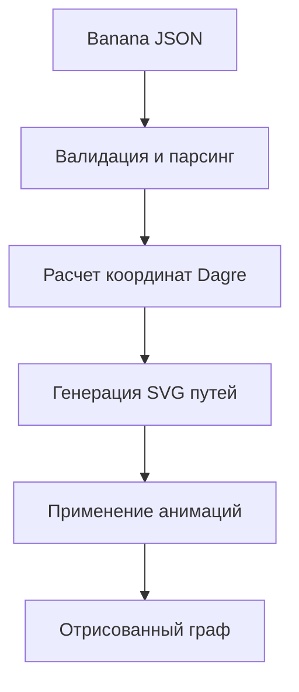

# 💻 Код: Логика рендеринга Banana JSON

## 📝 Детальное описание
Модуль отвечает за преобразование абстрактного графа (Banana JSON) в визуальное представление SVG. Он сочетает в себе использование библиотеки `dagre` для автоматического позиционирования узлов и `framer-motion` для создания плавных переходов между состояниями графа.

## 📊 Алгоритм работы (Flowchart)

## 📄 Функции модуля
| Функция | Параметры | Описание |
| :--- | :--- | :--- |
| `calculateLayout` | `data: BananaData` | Рассчитывает координаты всех узлов и ребер графа. |
| `generatePaths` | `nodes: Node[], edges: Edge[]` | Создает строковые определения путей для SVG-линий. |
| `getThemeColors` | `nodeType: string` | Возвращает цветовую схему на основе типа узла. |

## Навигация
- **Upstream**: [[3-Components/Frontend/BananaRenderer/BananaRenderer-Component|Компонент: BananaRenderer]]
- **Index**: [[Index|Вернуться к оглавлению]]
