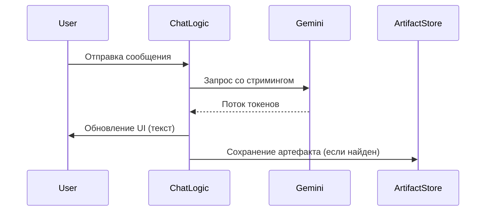

# 💻 Код: Логика чата

## 📝 Детальное описание
Данный модуль инкапсулирует всю логику взаимодействия с языковой моделью. Он отвечает за формирование промптов, управление историей сообщений (context window), обработку стриминговых ответов и выделение артефактов из текстового потока. Модуль также обрабатывает ошибки сети и таймауты API.

## 📊 Поток данных (Sequence Diagram)

## 📄 Функции модуля
| Функция | Параметры | Описание |
| :--- | :--- | :--- |
| `sendMessage` | `text: string, history: Message[]` | Отправляет новое сообщение в чат и инициирует запрос к ИИ. |
| `parseArtifacts` | `content: string` | Ищет и извлекает блоки кода/диаграмм из ответа модели. |
| `clearHistory` | `none` | Полностью очищает текущий контекст диалога. |

## Навигация
- **Upstream**: [[3-Components/Frontend/ChatPanel/ChatPanel-Component|Компонент: ChatPanel]]
- **Index**: [[Index|Вернуться к оглавлению]]
